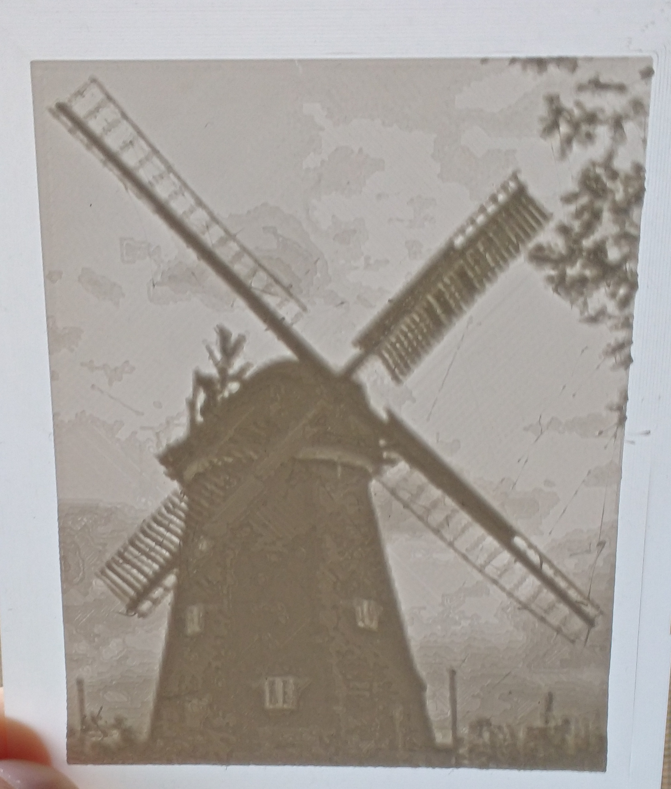
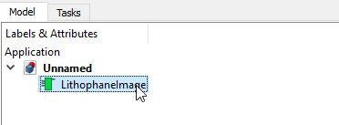
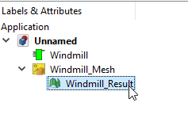
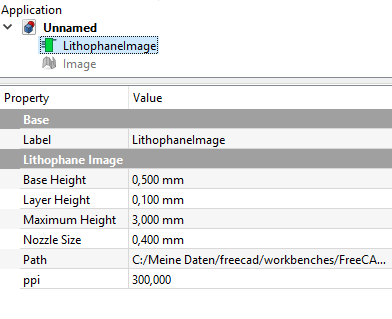
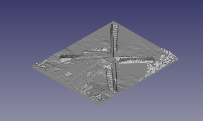
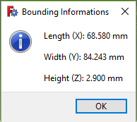

# FreeCAD-Lithophane

Convert a image to a Lithophane for 3D Printing

## What is a Lithophane
Basically a Lithophane is a image that was made in a way, that it can only be seen propertly when illuminated from behind. You can check out [Wikipedia](https://en.wikipedia.org/wiki/Lithophane) for more details.

## Getting started

    

    This section gives you a step by step instruction on how to convert this image (Feel free to use it for printing if you want)
    

to this awesome Lithophane

1. If not installed already go to [https://www.freecadweb.org/](https://www.freecadweb.org/) and grab yourself a fresh copy of FreeCAD and install it.
    - FreeCAD is a AWESOME free 3D CAD parametric modeling application.
    - Don't worry. You don't need to know much about 3D modelling to get a nice looking Lithophane out of this tool.

2. Install the Lithophane Workbench. The workbench is not in the addon manager right now. So you have to download the ZIP file from this repository and place it in your Mod folder. See [How to install additional workbenches](https://www.freecadweb.org/wiki/How_to_install_additional_workbenches) for further details.

3. Switch to the Lithophane workbench in FreeCAD
    - 

4. Click the "Import Image" button 
    - 
    - A file selector will be shown. Select the image and click "Open"
    - Depending on the image and your machine, it might take a while for the import to finish. On my 8 years old Intel i7-2670QM it takes about 8 seconds to import the windmill image (814x1000 pixels)
    - **FreeCAD might be unresponsive during the import**

5. Switch to the TreeView and select the imported image
    - 

6. Click the "Create Box" button
    - 
    - Depending on the image and your machine it might take a while to compute the geometry. On my machine the testimage needed about 2 Seconds to compute.
    - **FreeCAD might be unresponsive during the import**

7. Now you should see the image in the TreeView and the Viewport. You can pan and zoom to look on the image from different sides.
    - See [Mouse Model](https://www.freecadweb.org/wiki/Mouse_Model) for more informations on how to navigate in FreeCADs 3D View

8. Select the generated mesh in the TreeView and click on `File -> Export`. Choose `STL Mesh` (Or anything your slicer software could handle) as file format and save the file somwhere on your machine.
    - 

9. Fire Up your slicer (e.g. Cura) and load the exported file. Adapt the settings according to your 3D Printer and save the gcode. Load the gcode in your printer and let it print. This might take some hours to finish.

10. Have fun with your nice Lithophane image :)

## Command Details

This section describes each command in the workbench.

### Import Image

The command imports a new Image into the document. Therefor a Dialog is shown that let you select an image. After the image is selected it calculates the Point cloud from the pixel data of the image.

Depending on the image and your machine, it might take a while for the import to finish. On my 8 years old Intel i7-2670QM it takes about 8 seconds to import the windmill image (814x1000 pixels). **FreeCAD might be unresponsive during the import**.

The name of the imported image object will be taken from the image file.

**The pixel data whil be computed every time you recompute the image object!** This can happen when you change some settings of the image or force a recompute of the whole document.
For performance reasons the calculated point cloud is stored inside the FreeCAD file. So your files can get pretty big real fast when you import big images.

#### Image properties

The imported image has some properties that affect the final result. All this properties have some reasonable defaults. But feel free to change them if needed.

You find the properties in the `Data` tab of the properties editor, when the LithophaneImage is selected in the tree view.

**Base Height / Maximum Height**

These two properties define the height of the resulting geometry based on the lightning information of the image. Fully white parts of the image will result in the base height, fully black parts will map to the maximum height and everything else will be mapped to height values in between. Depending on the filament used to print your image you might want to adjust the values slightly.

**Layer Height**

3D Printers have a finite resolution on the Z Axis. The best my printer can print are layers of 0.1 mm in height. Based on the color of a pixel we can end up with a point at 0.05324 mm in Z direction. The 3D Printer is not able to print this. So we shift the point up or down to the nearest multiple of the given layer height.

This value should be set to the layer height you select in your slicer software. It can be set to 0 to get the raw height values based on the color information.

**Nozzle Size**

The nozzle of the 3D Printer defines how wide a line the printer prints will end up. Based on the image size we might end up with a huge amount of points, that might be impossible to handle for FreeCAD. Based on the dpi settings we might end up with points every 0.0something mm in X and Y direction. So we calculate the average of all the points in a `Nozzle Size`x`Nozzle Size` area to reduce the number of points drastically.

This value should match the nozzle size of your 3D Printer. It can be set to 0 to get the raw pixel data without averaging neightbour pixels. As said before. This can freeze your FreeCAD installation for a long time or crash it.

**Path**

The Path to the image file. You can change it to another image here if you want or simply import another image with the `Import Image` command.

**ppi**

The number of image pixels that will end up in one inch of the resulting geometry. Higher values normally result in more details in the final image. This property basically affects the size of the final geometry.

There will be a command in the future that helps you with calculating the right ppi value based on the final size you want for your image. https://github.com/furti/FreeCAD-Lithophane/issues/7

### Create Box

Creates the Lithophane geometry in the shape of a box with the image on top of it. You have to select the LithophaneImage in the TreeView before executing the command.

The name of the resulting mesh will be taken from the selected LithophaneImage. When the selected image is named `Windmill` the resulting mesh will be named `Windmill_Box`.

More Features might follow: https://github.com/furti/FreeCAD-Lithophane/issues/15

### Make Solid

Converts the Mesh selected to a solid. Should only be used with meshes created by the Lithophane Workbench because this command makes some assumptions on the structure of the mesh to speed up mesh creation. You have to select a single Mesh in the TreeView for this command to work.

**This command can take a long time and freeze your FreeCAD instance**. You can check the ReportView for the progress of the command. It shows a message after each step.

This command might be handy to convert your mesh and use the power of FreeCAD to modify the resulting Lithophane the way you want.

### Measure Size

Displays a Dialog with Length (in X direction), Width (in Y direction) and Height (in Z direction) of the selected Mesh. You have to select a Mesh in the TreeView for this command to work. It should work not only with Meshes created by the Lithophane Workbench but with all kind of Meshes in the document.

The command respects your unit and decimal preferences.

### Show Pointcloud

Displays all the Points the LithophaneImage contains in the 3D View. You have to select a LithophaneImage for this command to work.

This command might be useful for debugging purposes to check if the pixel data was interpreted as you imagine.

## Image Viewer

The workbench comes with a basic image viewer embedded. Simply double click on a LithophaneImage to display the image in a modal dialog.

## Compatibility
The Workbench should be compatible with the following FreeCAD Versions (at least on Windows):
 - 0.17
 - 0.18
 - 0.18 (Py3/QT5)

## Dependencies
The Workbench does not need any additional software to be installed to be fully functional.

The only exception could be a image manipulation program. This could be handy to change some aspects of the image like contrast or size before creating a Lithophane from it.

## Support
Found a bug? Have a nice feature request? Post to this FreeCAD Forum thread https://forum.freecadweb.org/viewtopic.php?f=9&t=30496 or simply create an issue in this repository.

## Limitations
 - Only tested on Windows 10 right now
 - Not tested with a lot of different images and image formats
 - Does not handle transparency correctly https://github.com/furti/FreeCAD-Lithophane/issues/14
 - Make Solid has some performance issues for bigger images and the created part is not a actual solid :(
