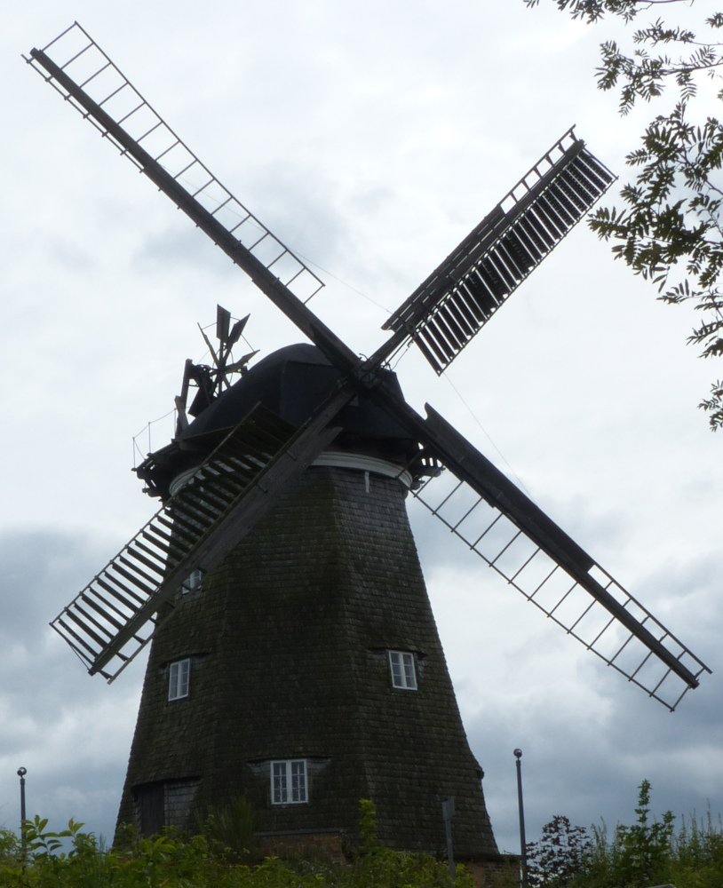

# FreeCAD-Lithophane

Convert a image to a Lithophane for 3D Printing

## What is a Lithophane
Basically a Lithophane is a image that was made in a way, that it can only be seen propertly when illuminated from behind. You can check out [Wikipedia](https://en.wikipedia.org/wiki/Lithophane) for more details.

## Getting started

This section gives you a step by step instruction on how to convert this image

to this awesome Lithophane

**TODO: add image of final lithophane**

1. If not installed already go to [https://www.freecadweb.org/](https://www.freecadweb.org/) and grab yourself a fresh copy of FreeCAD and install it.
    - FreeCAD is a AWESOME free 3D CAD parametric modeling application.
    - Don't worry. You don't need to know much about 3D modelling to get a nice looking Lithophane out of this tool.

2. Install the Lithophane Workbench. The workbench is not in the addon manager right now. So you have to download the ZIP file from this repository and place it in your Mod folder. See [How to install additional workbenches](https://www.freecadweb.org/wiki/How_to_install_additional_workbenches) for further details.

3. Switch to the Lithophane workbench in FreeCAD
    - 

4. Click the "Import Image" button 
    - 
    - A file selector will be shown. Select the image and click "Open"
    - Depending on the image and your machine, it might take a while for the import to finish. On my 8 years old Intel i7-2670QM it takes about 8 seconds to import the windmill image (814x1000 pixels)
    - **FreeCAD might be unresponsive during the import**

5. Switch to the TreeView and select the imported image
    - 

6. Click the "Create Box" button
    - 
    - Depending on the image and your machine it might take a while to compute the geometry. On my machine the testimage needed about 2 Seconds to compute.
    - **FreeCAD might be unresponsive during the import**

7. Now you should see the image in the TreeView and the Viewport. You can pan and zoom to look on the image from different sides.
    - See [Mouse Model](https://www.freecadweb.org/wiki/Mouse_Model) for more informations on how to navigate in FreeCADs 3D View

8. Select the generated mesh in the TreeView and click on `File -> Export`. Choose `STL Mesh` (Or anything your slicer software could handle) as file format and save the file somwhere on your machine.
    - 

9. Fire Up your slicer (e.g. Cura) and load the exported file. Adapt the settings according to your 3D Printer and save the gcode. Load the gcode in your printer and let it print. This might take some hours to finish.

10. Have fun with your nice Lithophane image :)

## Command Details

This section describes each command in the workbench.

### Import Image

The command imports a new Image into the document. Therefor a Dialog is shown that let you select an image. After the image is selected it calculates the Point cloud from the pixel data of the image.

Depending on the image and your machine, it might take a while for the import to finish. On my 8 years old Intel i7-2670QM it takes about 8 seconds to import the windmill image (814x1000 pixels). **FreeCAD might be unresponsive during the import**.

The name of the imported image object is hardcoded to `LithophaneImage` right now. So when importing more than one image it might be hard to distinguish the images from each other. See https://github.com/furti/FreeCAD-Lithophane/issues/12

**The pixel data whil be computed every time you recompute the image object!** This can happen when you change some settings of the image or force a recompute of the whole document.
For performance reasons the calculated point cloud is stored inside the FreeCAD file. So your files can get pretty big real fast when you import big images.

#### Image settings
TODO

### Create Box

Creates the Lithophane geometry in the shape of a box with the image on top of it.

The name of the resulting mesh is hardcoded to "Image" right now. See https://github.com/furti/FreeCAD-Lithophane/issues/12

**TODO: Add image that shows a final lithophane geometry in the 3D View**

More Features might follow: https://github.com/furti/FreeCAD-Lithophane/issues/15

### Make Solid

TODO

### Measure Size

TODO

### Show Pointcloud

TODO

## Limitations
 - Only tested in FreeCAD 0.18 on Windows 10 right now
 - Not tested with a lot of different images and image formats
 - Does not handle transparency correctly https://github.com/furti/FreeCAD-Lithophane/issues/14
 - Not test with Python 3 and QT5 Builds right now
 - Make Solid has some performance issues for bigger images and the created part is not a actual solid :(
